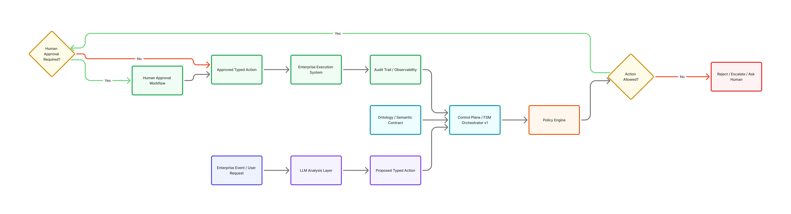

# LLM as an Untrusted Component

## Executive Summary

Large Language Models (LLMs) are powerful reasoning and language-generation systems, but they are probabilistic components rather than deterministic enterprise control systems.

Zotikos proposes an architecture where LLMs operate inside a governed enterprise control plane rather than directly controlling enterprise execution.

The architecture combines:

- FSM orchestration
- Typed enterprise actions
- Policy enforcement
- Human approval workflows
- Ontology-aware reasoning
- Auditability and traceability

This approach enables regulated enterprises to safely adopt AI capabilities without surrendering operational governance.

---

# 1. The Problem

Modern “agentic AI” architectures frequently allow LLMs to directly:

- Trigger workflows
- Execute actions
- Modify systems
- Make operational decisions
- Coordinate distributed services

This creates major enterprise risks:

- Non-deterministic behaviour
- Hallucinated actions
- Policy violations
- Lack of explainability
- Uncontrolled execution
- Weak auditability
- Regulatory exposure

In regulated industries such as banking, insurance, and telecommunications, this risk profile is unacceptable.

---

# 2. Core Principle

LLMs may assist reasoning.

LLMs must not directly control enterprise execution.

Enterprise execution must remain deterministic, governed, auditable, and policy-aware.

---

# 3. Proposed Architecture

The Zotikos architecture separates:

- AI reasoning
- Enterprise governance
- Workflow orchestration
- Action execution

The LLM becomes an advisory subsystem rather than an autonomous operational controller.

## Architecture Diagram

---

# 4. Architectural Components

## 4.1 LLM Layer

Responsibilities:

- Classification
- Summarization
- Recommendation
- Entity extraction
- Risk scoring assistance
- Natural language interpretation

Characteristics:

- Probabilistic
- Non-deterministic
- Untrusted for direct execution

---

## 4.2 Control Plane

Responsibilities:

- FSM orchestration
- Workflow governance
- State transitions
- Policy coordination
- Execution routing

Characteristics:

- Deterministic
- Auditable
- Observable
- Governed

---

## 4.3 Typed Action Layer

Actions are represented as explicit typed contracts.

Examples:

- FreezeAccount
- EscalateCase
- RequestHumanApproval
- BlockTransaction
- NotifyFraudTeam

The LLM cannot directly execute arbitrary operations.

It may only propose typed actions which must pass governance validation.

---

## 4.4 Policy Engine

Responsibilities:

- Regulatory validation
- Operational policy enforcement
- Risk thresholds
- Approval rules
- State validation

---

## 4.5 Human Governance Layer

Responsibilities:

- Approval workflows
- Manual escalation
- Risk acceptance
- Exception handling

Human governance remains part of the operational architecture.

---

# 5. Ontology as Contract

Ontology provides:

- Shared enterprise meaning
- Semantic relationships
- Policy context
- State-aware reasoning
- Enterprise object modelling

Ontology becomes the semantic control layer connecting:

- AI reasoning
- Enterprise policy
- Workflow orchestration
- Operational execution

---

# 6. Example Workflow

Example:

1. Suspicious banking event detected
2. LLM classifies possible fraud pattern
3. FSM control plane evaluates current workflow state
4. Policy engine validates allowed actions
5. Typed action proposed:
   - RequestHumanApproval
6. Fraud analyst approves escalation
7. Control plane transitions workflow state
8. Typed action executes:
   - FreezeAccount
9. Full audit trail recorded

---

# 7. Why Determinism Matters

Enterprise systems require:

- Predictability
- Auditability
- Governance
- Regulatory compliance
- Operational safety
- Controlled failure handling

Purely autonomous AI architectures weaken these guarantees.

Deterministic orchestration restores operational control.

---

# 8. Industry Relevance

## Banking

- Fraud response
- Transaction governance
- Customer risk workflows
- Regulatory compliance

## Insurance

- Claims workflows
- Risk governance
- Policy enforcement

## Telecommunications

- SIM swap fraud
- Identity trust systems
- Customer risk orchestration

---

# 9. Strategic Position

Zotikos does not position AI as autonomous enterprise authority.

Zotikos positions AI as a governed subsystem operating inside deterministic enterprise architecture.

This enables enterprises to safely adopt AI while preserving governance, traceability, and operational trust.

---

# 10. Conclusion

The future of enterprise AI is not uncontrolled autonomy.

The future is governed intelligence operating inside deterministic control systems.

LLMs can assist reasoning.

Governed systems must control execution.

