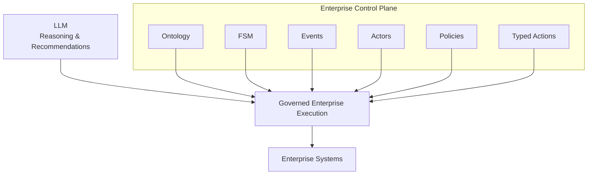

# From LLMs to Governable Enterprise Systems

## Executive Summary

Large Language Models (LLMs) are transforming software systems by providing powerful reasoning and natural language capabilities. However, most current agentic AI architectures allow LLMs to directly control enterprise workflows, execute actions, and make operational decisions.

This creates significant governance, compliance, auditability, and operational risks.

Zotikos proposes an alternative architecture in which LLMs operate as advisory and reasoning components inside a governed enterprise control plane.

The architecture combines:

- Enterprise Ontologies
- Finite State Machines (FSMs)
- Explicit Events
- Actor Models
- Policy Enforcement
- Typed Enterprise Actions
- Human Approval Workflows

Together, these components create enterprise systems that remain deterministic, auditable, governable, and compliant while still benefiting from modern AI capabilities.

The result is a Governable Enterprise System.

---

## 1. The Problem

Most modern agentic AI architectures allow LLMs to:

- Trigger workflows
- Execute actions
- Coordinate systems
- Make operational decisions
- Interact with enterprise applications

While these capabilities appear attractive, they introduce significant risks.

LLMs are probabilistic systems.

Enterprise systems require deterministic governance.

This mismatch creates a fundamental architectural problem.

---

## 2. Why Agentic AI Is Dangerous

Current agentic architectures frequently permit AI systems to:

- Invoke tools directly
- Execute transactions
- Modify records
- Trigger workflows
- Coordinate external services

This introduces:

- Hallucinated actions
- Unpredictable behaviour
- Policy violations
- Weak auditability
- Compliance challenges
- Operational risk

The issue is not that LLMs are unreliable.

The issue is that enterprise control has been delegated to components that were never designed to be enterprise control systems.

---

## 3. LLM as an Untrusted Component

Zotikos treats the LLM as an untrusted component.

The LLM may:

- Interpret information
- Classify information
- Generate recommendations
- Assist human operators

The LLM may not:

- Execute enterprise actions directly
- Modify enterprise state directly
- Bypass governance controls

All enterprise execution remains controlled by the enterprise control plane.

## 4. Enterprise Ontologies

Enterprise systems operate on business concepts rather than prompts.

Examples include:

- Customer
- Policy
- Claim
- Payment
- Fraud Case
- Investigation
- Decision

An enterprise ontology defines these concepts and their relationships.

Unlike prompts, ontologies provide:

- Explicit meaning
- Consistent terminology
- Traceable relationships
- Shared understanding across systems

The ontology becomes the semantic foundation of the enterprise control plane.

All decisions, events, policies, and actions operate against explicitly defined enterprise concepts.

---

## 5. Finite State Machines

Enterprise processes are governed by state transitions.

A fraud investigation, for example, may progress through states such as:

- Created
- Assigned
- Investigating
- Awaiting Approval
- Approved
- Rejected
- Executing Action
- Closed

Finite State Machines (FSMs) provide deterministic control over these transitions.

Unlike LLM-generated workflows, FSMs ensure that only valid transitions can occur.

The FSM becomes the behavioral model of the enterprise process.

---

## 6. Events

State transitions occur because events happen.

Examples include:

- AssignCase
- StartInvestigation
- SubmitRecommendation
- ApproveCase
- RejectCase
- ExecuteAction

Events provide explicit and auditable explanations for why a system changed state.

Every state transition must be triggered by a recognized event.

This creates a complete and traceable history of enterprise execution.

## 7. Actors

Enterprise systems do not operate autonomously.

Every significant decision originates from an actor.

Actors may include:

- Human operators
- Investigators
- Supervisors
- Governance officers
- External systems
- Automated services

Actors provide accountability.

An event without an actor lacks ownership.

By explicitly modelling actors, the enterprise control plane can answer:

- Who initiated the action?
- Who approved the decision?
- Who bears responsibility?

This creates traceability and governance.

---

## 8. Policies

Policies define the rules under which enterprise actions may occur.

Examples include:

- Approval limits
- Risk thresholds
- Regulatory requirements
- Segregation of duties
- Business rules

Policies operate independently from the LLM.

The LLM may recommend an action.

The policy engine determines whether the action is permitted.

This separation ensures that governance remains deterministic and auditable.

---

## 9. Typed Enterprise Actions

Enterprise systems ultimately perform actions.

Examples include:

- FreezeAccount
- BlockCard
- RejectClaim
- ApprovePayment
- NotifyCustomer

These actions must be explicit, typed, and governed.

The LLM never executes arbitrary actions.

Instead, it may recommend one or more predefined enterprise actions.

The control plane validates the recommendation against the ontology, state machine, actors, and policies before execution.

This prevents uncontrolled or hallucinated system behaviour.

## 10. Enterprise Control Plane

The Enterprise Control Plane is the governing layer that coordinates enterprise execution.

It sits between AI reasoning components and operational systems.

The control plane combines:

- Enterprise Ontologies
- Finite State Machines
- Events
- Actors
- Policies
- Typed Enterprise Actions

Together these components provide deterministic governance over enterprise operations.

The control plane does not attempt to replace AI.

Instead, it constrains and governs AI participation within enterprise processes.

The LLM becomes a participant in the system rather than the system itself.

This separation allows enterprises to benefit from AI capabilities while maintaining operational control.

---

## 11. Reference Implementation: Fraud Investigation 

Consider a fraud investigation process.

A new fraud case enters the system in the Created state.

A Fraud Analyst assigns the case and begins an investigation.

The investigation generates evidence and recommendations.

Once sufficient evidence has been collected, the analyst submits a recommendation for approval.

A Governance Officer evaluates the recommendation according to enterprise policies.

If approved, the system executes one or more typed actions such as:

- FreezeAccount
- BlockCard
- EscalateInvestigation
- NotifyCustomer

Throughout the process:

- Every object is defined by the ontology.
- Every state change is controlled by the FSM.
- Every transition is triggered by an event.
- Every event is associated with an actor.
- Every decision is evaluated against policies.
- Every execution occurs through typed actions.

The LLM may assist by analysing evidence, identifying patterns, or generating recommendations.

However, the LLM never directly controls enterprise execution.

---

## 12. Benefits

The Governable Enterprise System provides several advantages over traditional agentic architectures.

### Deterministic Execution

Enterprise behaviour is governed by explicit state transitions rather than probabilistic model outputs. Every significant action follows a defined process and can be validated against enterprise rules.

### Auditability

Every decision, event, actor, state transition, and action can be traced and reviewed. This creates a complete execution history suitable for operational review, governance, and regulatory compliance.

### Compliance

Policies can be enforced consistently across all enterprise workflows. Regulatory requirements become explicit components of the system rather than afterthoughts.

### Explainability

The system can explain why a decision was made, which policies were evaluated, which actors participated, and which actions were ultimately executed.

### Human Governance

Critical decisions remain subject to human oversight and approval. AI can assist decision-making without bypassing enterprise accountability.

### AI Safety

The LLM cannot directly execute uncontrolled enterprise actions. Recommendations are evaluated by the control plane before any operational execution occurs.

### Enterprise Reusability

The same control plane concepts can be applied across multiple domains, including:

- Fraud Management
- Claims Processing
- Payments
- Customer Onboarding
- KYC
- AML
- Underwriting
- Telecommunications Operations
- Healthcare Workflows
- Government Services

The architecture is reusable because governance concepts remain consistent across domains.

---

## 13. Conclusion

The future of enterprise AI is not autonomous execution.

It is governed execution.

Large Language Models are powerful reasoning engines. They can analyse information, identify patterns, generate recommendations, and assist human decision makers.

However, they were not designed to function as enterprise control systems.

Enterprises have spent decades building governance structures, approval processes, audit controls, compliance frameworks, and operational safeguards. AI adoption should strengthen these capabilities rather than bypass them.

The challenge is not how to make AI more autonomous.

The challenge is how to make AI more governable.

By combining enterprise ontologies, finite state machines, events, actors, policies, and typed actions within a unified Enterprise Control Plane, organizations can safely integrate AI into mission-critical operations while maintaining deterministic governance and operational control.

Zotikos proposes that enterprise AI should not be built around autonomous agents.

It should be built around governable enterprise systems.

AI should participate in enterprise execution.

Enterprise governance should remain in control.

---

## 14. References

Supporting Zotikos artifacts:

- LLM as an Untrusted Component
- Fraud Ontology v1-v4
- Fraud FSM v1-v4
- Enterprise Control Plane Diagram v1

These supporting artifacts provide reference implementations and practical examples of the architectural principles described in this paper.

---

## About the Author

Sandor Vas is a Principal Systems Architect with experience spanning embedded systems, high-performance computing, banking infrastructure, cloud-native platforms, data engineering, and AI governance.

Through Zotikos Consulting, he focuses on building governable enterprise systems that combine modern AI capabilities with deterministic operational control, auditability, and compliance.
